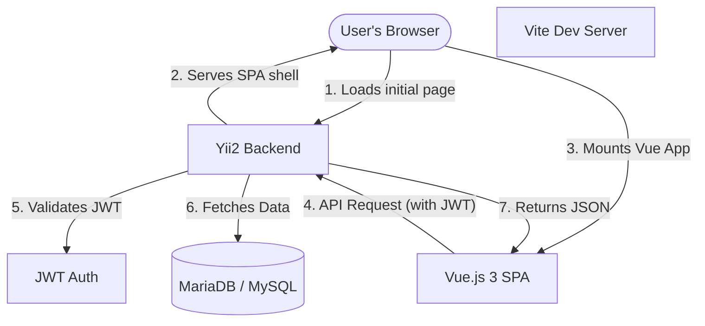

# System Architecture: YiiVue-SPA Advanced Template

This document provides a high-level overview of the architectural design, technologies, and technical choices made in this project. It is intended for developers, architects, and panel reviews.

---

## 1. High-Level Architecture Overview
The system follows a **Decoupled Architecture** (also known as a "Modern Monolith" approach). It leverages the strengths of two industry-standard frameworks:
- **Yii2 (Backend):** Handles data integrity, business logic, security, and the database.
- **Vue.js 3 (Frontend):** Handles the user interface, client-side state, and interactivity.

The core principle is **"Thin Backend, Thick Frontend"**.

---

## 2. Backend Design (Yii2 Advanced)
We utilize the **Yii2 Advanced Template** as our foundation because it provides a clear separation of concerns:

- **Common Layer (`/common`):** Houses the DB schema (migrations), ActiveRecord models, and core business rules. This ensures data consistency across the entire system.
- **RESTful API Layer:** All data-providing controllers inherit from `yii\rest\Controller`. This ensures out-of-the-box support for:
  - JSON serialization.
  - Standardized HTTP status codes.
  - Rate limiting and request parsing.
- **Security (JWT):** Unlike traditional session-based auth, we use **JSON Web Tokens (JWT)**. This allows the backend to be stateless, improving scalability and making it easier to serve mobile apps or other clients later.
- **Environment Management:** We use `vlucas/phpdotenv` to manage all environment-specific configurations. This separates sensitive credentials from the application code, following the **Twelve-Factor App** methodology. Configuration is centralized in a `.env` file, which is loaded at bootstrap.

---

## 3. Frontend Design (Vue.js 3 + Vite)
The frontend is a modern Single Page Application (SPA) built with:

- **Vue.js 3 (Composition API):** Provides a reactive, component-based UI that is fast and easy to maintain.
- **Vite:** Our build tool of choice. It offers near-instant hot module replacement (HMR), drastically speeding up development compared to traditional Webpack setups.
- **Tailwind CSS + Shadcn UI:** A utility-first CSS framework combined with accessible, high-quality UI components. This ensures a consistent, professional design with minimal effort.
- **Vue Router:** Manages all client-side navigation. The user never experiences a full page reload after the initial load.

---

## 4. The Integration (The "Bridge")
One of the unique features of this architecture is how Yii2 and Vue are connected:

1. **The SPA Controller:** A dedicated Yii controller (`SpaController`) renders exactly one PHP view. This view serves as the entry point for the Vue app.
2. **Environment Awareness:** In `Development` mode, Yii dynamically checks if the Vite server is running. If so, it pulls assets from the dev server (`localhost:5173`). In `Production` mode, it automatically switches to the pre-compiled, minified assets in `frontend/web/spa/`.
3. **Cross-Origin Handling (CORS):** The backend includes a `CorsFilter` to allow the Vue dev server (running on a different port) to communicate with the API without security blocks.

---

## 5. Deployment & Scalability
- **Docker Ready:** The entire stack is containerized. This ensures the application runs exactly the same way on a developer's machine as it does on a production server.
- **Composer Package Ready:** The project structure follows PSR-4 standards and is designed to be easily clonable and initialized as a template, similar to the official Yii2 advanced package.
- **Database Migrations:** All schema changes are tracked via Yii's migration system, ensuring version-controlled database updates.

---

## 6. Security Features
- **JWT Protection:** Sensitive endpoints are protected by JWT Bearer authentication.
- **CSRF Consideration:** Since we use JWT and REST APIs, we selectively disable standard CSRF validation for API endpoints, as JWT itself provides protection against cross-site request forgery when properly implemented.
- **Validation:** All incoming data is validated using Yii's robust `Model` validation rules before being persisted to the database.

---

## 7. Summary
This architecture combines the **reliability of PHP/Yii2** for data management with the **rich user experience of Vue.js**. It is a future-proof, professional-grade setup that allows developers to build complex applications with ease.
